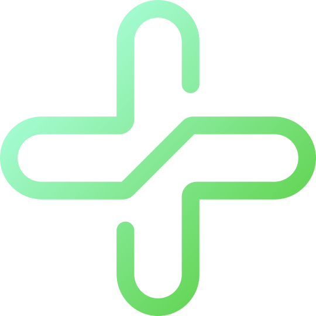

# MediBox.kz 

**MediBox.kz** is an online platform that aims to simplify access to healthcare services in Kazakhstan. It provides users with a seamless experience for booking medical appointments, purchasing medications, and renting medical equipment and spaces. The goal of MediBox is to ensure transparency in the medical services and products market, offering users a quick and easy way to compare options and make informed decisions.

## Features

- **Clinics**: Compare prices and reviews of medical services to find the best option for your needs.
- **Pharmacies**: Easily purchase medications, supplements, and other health-related products with quick home delivery.
- **Booking Medical Services**: Book appointments for medical consultations, treatments, and procedures.
- **Renting Medical Equipment and Spaces**: Rent medical equipment or spaces for healthcare-related needs.

## Project Goals

The primary goal of **MediBox.kz** is to simplify and improve the healthcare experience by providing a comprehensive platform for:

- Searching and comparing medical services and pharmacies.
- Easily booking medical services and renting necessary medical equipment and spaces.
- Ensuring transparency and accessibility for users in Kazakhstan's healthcare system.

## Technologies Used

- **Frontend**: Vue.js, Nuxt.js, Tailwind CSS
